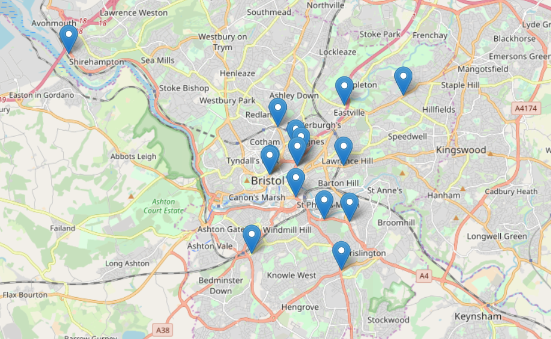
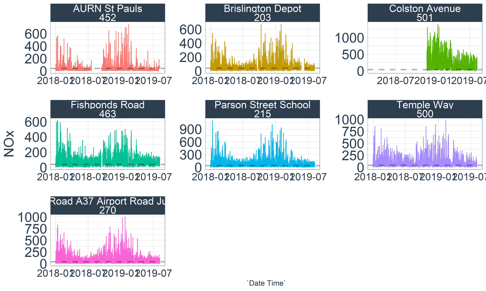
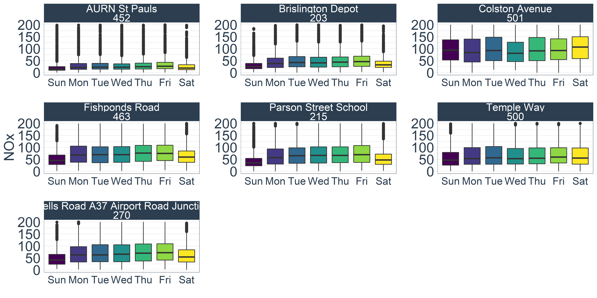
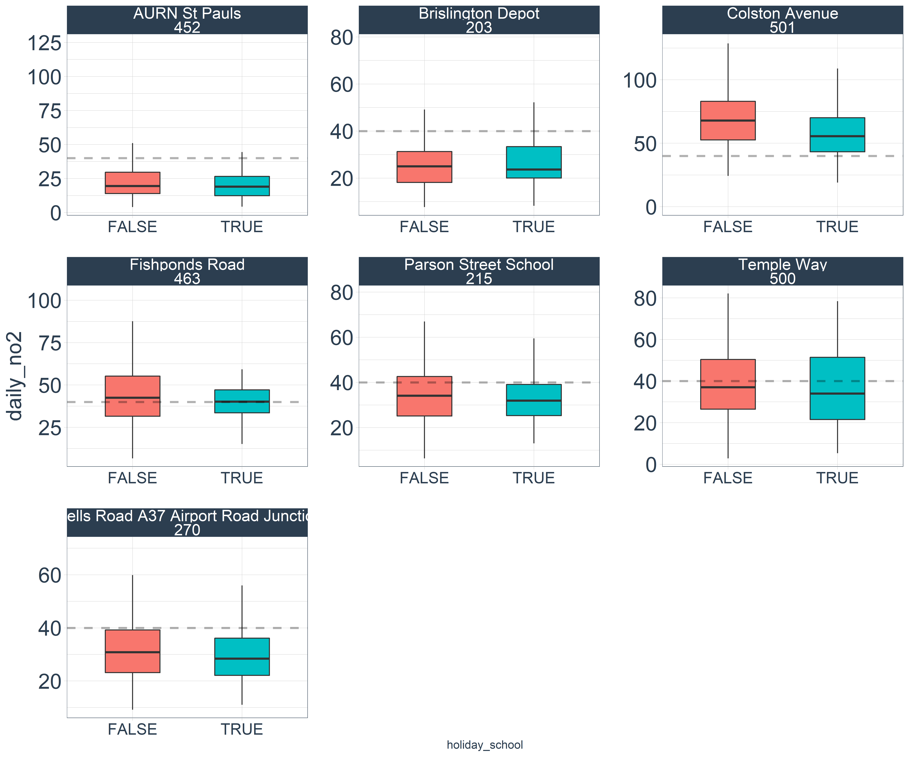

```{r setup, include=FALSE,echo=F}
knitr::opts_chunk$set(echo = TRUE)
library(tidyverse)
library(sf)
library(leaflet)

Sys.setlocale("LC_ALL","English")

```


# Approach 1: Exploring the structrue of air quality data for Bristol
## Theory
- There are ample evidence of negative relationships between NO<sub>x</sub> and children's risk of health e.g. asthma, headache, obstacles of growth.
- Some schoolzones in Bristol are now facing a serious risk of pollution due to the high volume of vehicles that park and travel during rush hours, which can badly affect their health.
- Here, this section explores the temporal features of NO<sub>x</sub> and examine the relationship on schoolzones.

## Data collection

- Bristol city council has released a diverse range of dataset on their [Bristol Opendata Portal](https://opendata.bristol.gov.uk/pages/homepage/). 
- We collected [live and historic air quality continous data (1998-2019)](https://opendata.bristol.gov.uk/explore/dataset/air-quality-data-continuous/information/?disjunctive.location) from 16 data stations.
- 7 Stations (location with bold text) are currently monitored 

| No | Location                             | Long          |  Lat           | 
|----|--------------------------------------|--------------|-------------| 
| 1  | IKEA M32                             | -2.562080909 | 51.47528351 | 
| 2  | **Brislington Depot**                | -2.559957358 | 51.44174549 | 
| 3  | **Parson Street School**             | -2.604960109 | 51.43267424 | 
| 4  | Rupert Street                        | -2.596264255 | 51.45543156 | 
| 5  | Temple Meads Station                 | -2.584479686 | 51.448882   | 
| 6  | **Wells Road A37 Airport Road Junction** | -2.563742255 | 51.42786218 | 
| 7  | Trailer Portway P&R                  | -2.688782154 | 51.4899919  | 
| 8  | Shiner's Garage                      | -2.562715339 | 51.45779166 | 
| 9  | Newfoundland Road Police Station     | -2.582254947 | 51.46067249 | 
| 10 | Bath Road                            | -2.571377284 | 51.44253562 | 
| 11 | **AURN St Pauls**                    | -2.584542374 | 51.46282815 | 
| 12 | Cheltenham Road \\ Station Road      | -2.592726071 | 51.46893743 | 
| 13 | **Fishponds Road**                   | -2.535231103 | 51.47804341 | 
| 14 | **Temple Way**                       | -2.583990689 | 51.45794827 | 
| 15 | **Colston Avenue**                   | -2.596650718 | 51.45526774 | 
| 16 | AQ Mesh Temple Way                   | -2.583990689 | 51.45794827 | 

```{r, echo=F, fig.cap="Location"}
# Overall locations 16


```


## Experiment
### NO<sub>x</sub>

* Temporal
-
-
-

```{r, echo=F, eval=F, fig.cap="Linear trend of NOx by 16 Stations"}
knitr::include_graphics("nox_temporal.png")
```

* Monthly-aggregated boxplots
-
-
-

```{r, echo=F, fig.cap=""}
knitr::include_graphics("nox_box_month_hour.png")

```

* Stats
-
-
-
-
-


### NO<sub>x</sub> after 2018

* Overall
- How many times did it exceed 200µg/m3?
- What
```{r, echo=F, fig.cap=""}


```


* Weekdays
```{r, echo=F, fig.cap=""}


```

* School Holiday

```{r, echo=F, fig.cap=""}


```


* Bank Holiday


```{r, echo=F, fig.cap=""}


```


